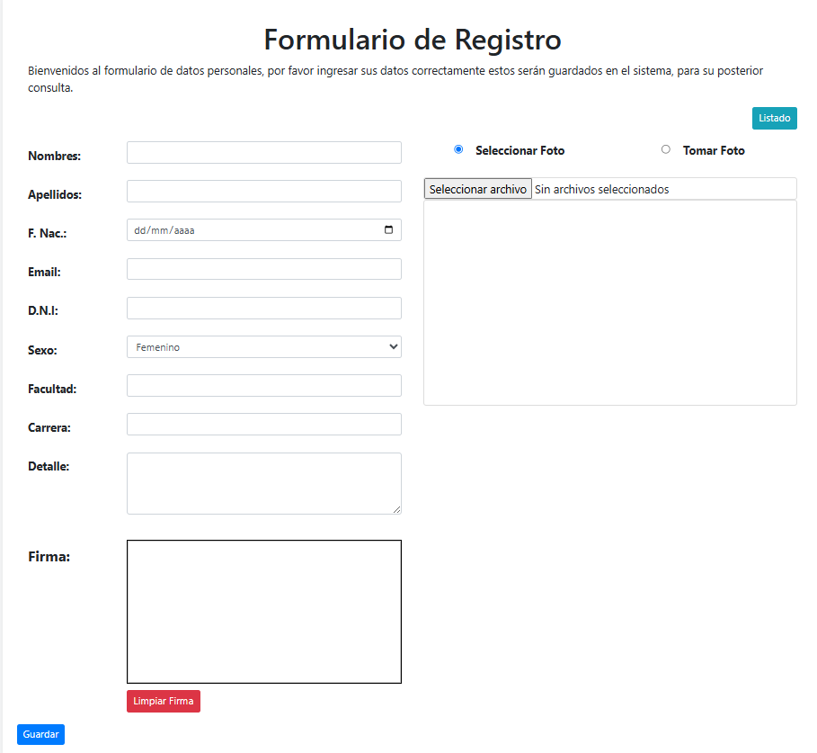

# HTML Form with Camera Integration

This project demonstrates how to use HTML and JavaScript to capture images from a webcam and store them using a backend in PHP.

## 🖼️ Preview

## 📂 Project Structure

- `index.html`: Main camera form
- `lista.html`: List view of captured entries
- `backend/`: PHP endpoints to store and retrieve data
- `custom/`: CSS or JS extras
- `camaraweb.sql`: Database structure
